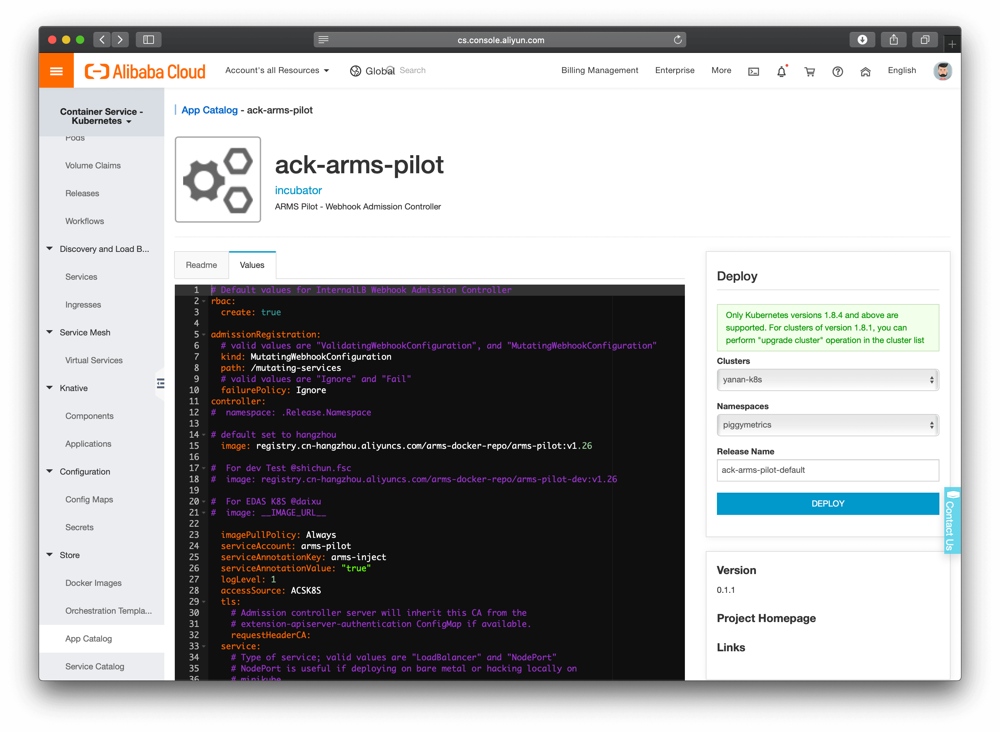
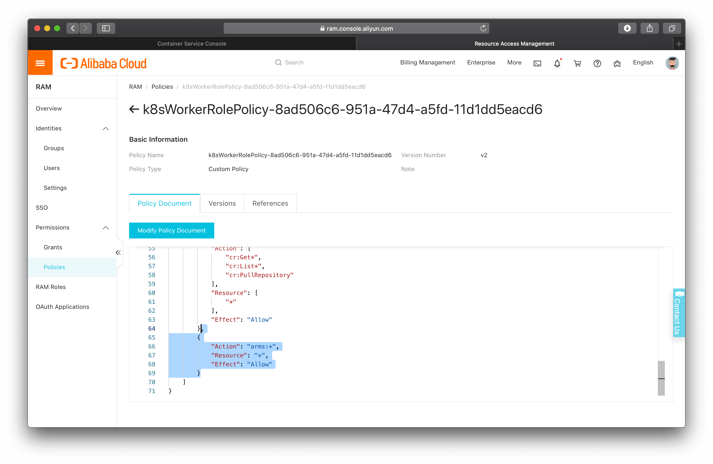
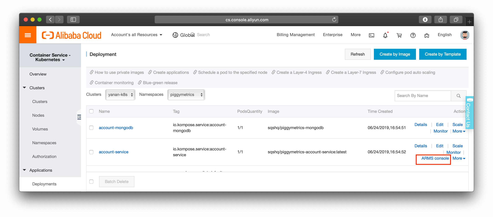
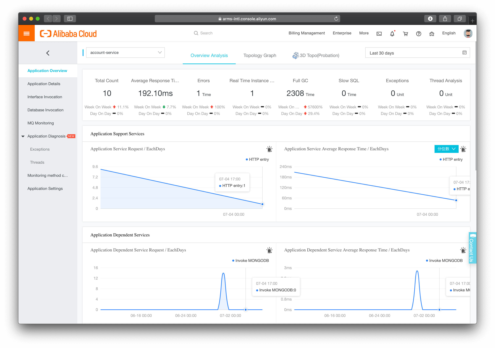

# Intro

ARMS ([Application Realtime Monitoring Service](https://www.alibabacloud.com/product/arms)) is for application level monitoring. It's strong at Java applications and can integrate with ACK ([Alibaba Container Service for Kubernetes](https://www.alibabacloud.com/product/kubernetes)) easily.

# Demo

Use ARMS to monitor PiggyMetrics which deployed on ACK. This process is generic, it can be applied to other applications with same procedure.

## Step 1: enable ARMS

Enable ARMS from web console if you haven't done so.

## Step 2: install ARMS from ACK App Catalog

ACK provides an app catalog for easy tooling installation. Access from [ACK console](https://cs.console.aliyun.com)->Store->App Catalog.


The ARMS component can be installed with a single click.



## Step 3: verify the installation

The component then later can be located in the namespace.


## Step 4: config RAM role

In order for the cluster to access the ARMS service, we need to add ARMS access to the worker's role.

Go to Clusters->Cluster List and locate your cluster, then click and check the Basic Information:


Then edit the associated policy:


Append the following block to the policy statement (and don't forget to add `,` before the block):

```JSON
{
    "Action": "arms:*",
    "Resource": "*",
    "Effect": "Allow"
}
```



## Step 5: edit the app YAML file

This is the last step. Locate the Java application deployment from Applications->Deployments and click `more` from the Action column, then click `YAML` to edit.

Add the following annotation in `spec`->`template`->`metadata`->`annotations`.

```YAML
annotations:
    armsPilotAutoEnable: 'on'
    armsPilotCreateAppName: 'account-service'
```


Then click `Update`.

After the deployment restarted, you will find `ARMS console` appears at the Action column.



Enjoy!


