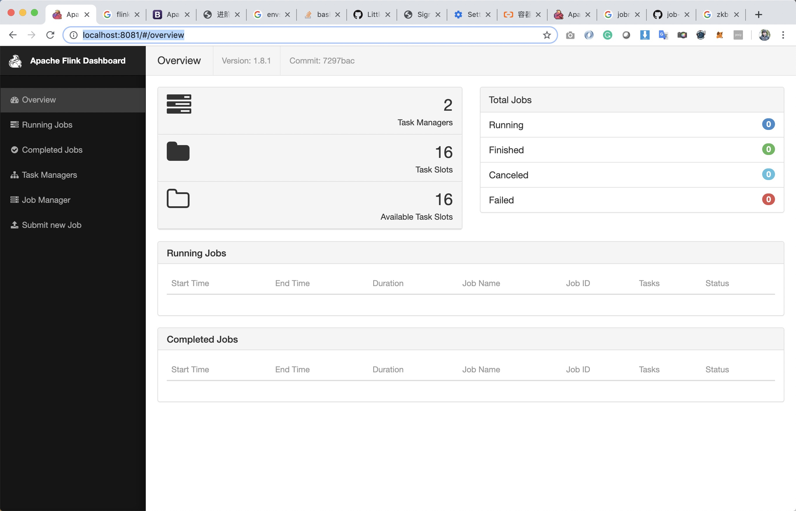
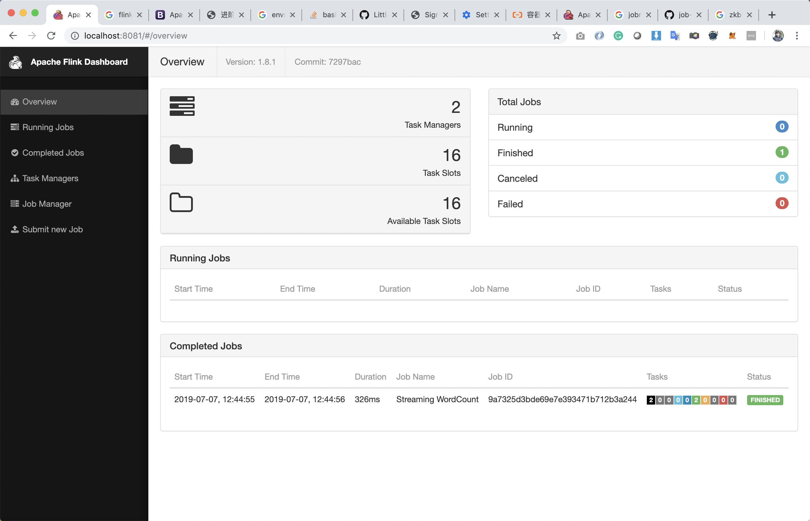
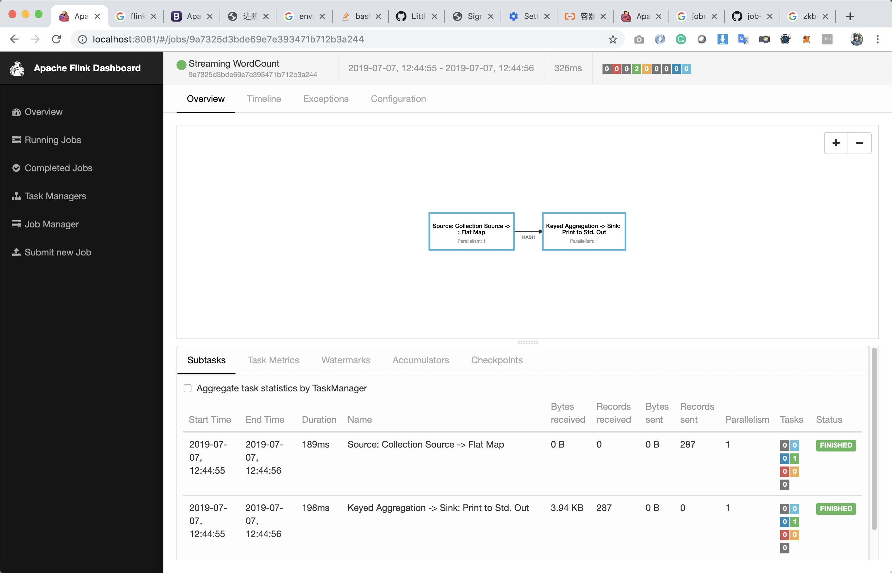

# flink on k8s

## standalone mode

## session cluster mode

```bash 

# reference: https://ci.apache.org/projects/flink/flink-docs-stable/ops/deployment/kubernetes.html#session-cluster-resource-definitions

# create flink session cluster
$ kubectl create -f jobmanager-service.yaml
$ kubectl create -f jobmanager-deployment.yaml
$ kubectl create -f taskmanager-deployment.yaml

# check if pod is ready
$ kubectl get pods
NAME                                READY   STATUS    RESTARTS   AGE
flink-jobmanager-676d7f5fb5-4rdd9   1/1     Running   0          14s
flink-taskmanager-9bf7c94bc-5lf79   1/1     Running   0          10s
flink-taskmanager-9bf7c94bc-rhwvd   1/1     Running   0          10s

# check if service is ready
$ kubectl get svc
NAME               TYPE        CLUSTER-IP     EXTERNAL-IP   PORT(S)                                                       AGE
flink-jobmanager   NodePort    172.21.10.59   <none>        6123:31268/TCP,6124:31083/TCP,6125:31527/TCP,8081:31981/TCP   113s
kubernetes         ClusterIP   172.21.0.1     <none>        443/TCP                                                       7d20h

# port-forward to be able to visit flink ui
$ kubectl port-forward service/flink-jobmanager 8081:8081
# open http://localhost:8081/#/overview 

$ brew info apache-flink 
/usr/local/Cellar/apache-flink/1.8.0
$ cd /usr/local/Cellar/apache-flink/1.8.0/libexec
$ ./bin/flink run -d -m localhost:8081 ./examples/streaming/WordCount.jar
$ ./bin/flink run -d -m localhost:8081 ./examples/streaming/TopSpeedWindowing.jar


# finish and the delete
$ kubectl delete -f jobmanager-deployment.yaml
$ kubectl delete -f taskmanager-deployment.yaml
$ kubectl delete -f jobmanager-service.yaml

```






# job cluster mode


