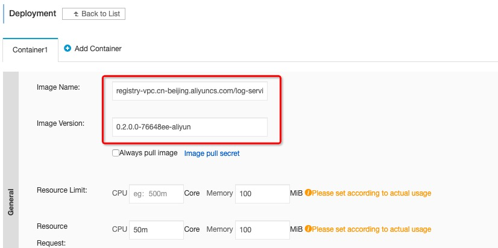
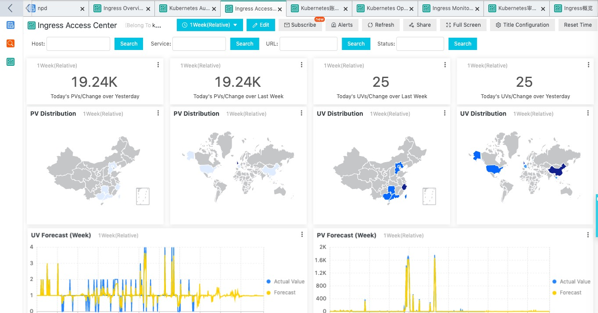

# demo purpose:
via LogService to detect the dashboard of ingress , kubernetes audit and so on.

# steps


## step 1: Install log service when create k8s cluster


## step2: Check Log Controller image and version.

* Find deployment: alibaba-log-controller in kube-system namespace.
* Replace image name and version: registry-vpc.{region-id}.aliyuncs.com/log-service/alibabacloud-log-controller, region-id is which region is your cluster created. Version is 0.2.0.0-76648ee-aliyun or higher.



## step3: Deploy CRD(customer resource definition) Ingress: 
```yaml
apiVersion: log.alibabacloud.com/v1alpha1
kind: AliyunLogConfig
metadata:
  # your config name, must be unique in you k8s cluster
  name: k8s-nginx-ingress
spec:
  # logstore name to upload log
  logstore: nginx-ingress
  # product code, only for k8s nginx ingress
  productCode: k8s-nginx-ingress
  # logtail config detail
  logtailConfig:
    inputType: plugin
    # logtail config name, should be same with [metadata.name]
    configName: k8s-nginx-ingress
    inputDetail:
      plugin:
        inputs:
        - type: service_docker_stdout
          detail:
            IncludeLabel:
              io.kubernetes.container.name: nginx-ingress-controller
            Stderr: false
            Stdout: true
        processors:
        - type: processor_regex
          detail:
            KeepSource: false
            Keys:
            - client_ip
            - x_forward_for
            - remote_user
            - time
            - method
            - url
            - version
            - status
            - body_bytes_sent
            - http_referer
            - http_user_agent
            - request_length
            - request_time
            - proxy_upstream_name
            - upstream_addr
            - upstream_response_length
            - upstream_response_time
            - upstream_status
            - req_id
            - host
            NoKeyError: true
            NoMatchError: true
            Regex: ^(\S+)\s-\s\[([^]]+)]\s-\s(\S+)\s\[(\S+)\s\S+\s"(\w+)\s(\S+)\s([^"]+)"\s(\d+)\s(\d+)\s"([^"]*)"\s"([^"]*)"\s(\S+)\s(\S+)+\s\[([^]]*)]\s(\S+)\s(\S+)\s(\S+)\s(\S+)\s(\S+)\s*(\S*).*
            SourceKey: content
```

* refrence: https://www.alibabacloud.com/help/doc-detail/86532.htm

## step4: Go to logserver console
* logservice console(https://sls.console.aliyun.com/#/) to get all kinds of dashboard.
* notice: the project name is ACK cluster name.


* Select "Dashboard" menu


* Click one of the dashboard, below diagram is "Ingress Access Center".

