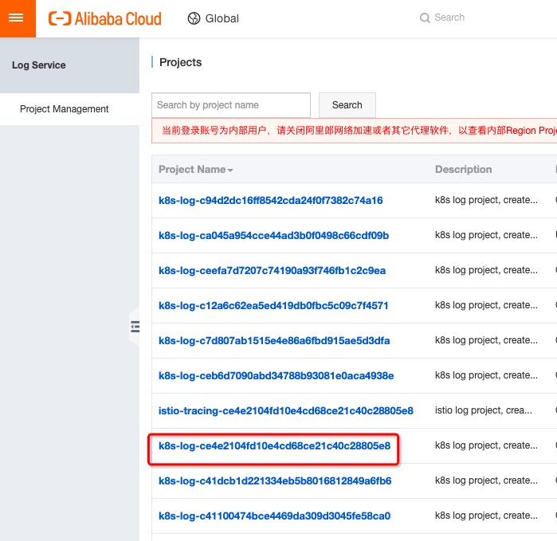

# demo purpose:
via LogService to detect the dashboard of ingress , kubernetes audit and so on.

# steps

```bash
## step 1: Install log service when create k8s cluster


## step2: Check Log Controller image and version.

# Find deployment: alibaba-log-controller in kube-system namespace.
# Replace image name and version: registry-vpc.{region-id}.aliyuncs.com/log-service/alibabacloud-log-controller, region-id is which region is your cluster created. Version is 0.2.0.0-76648ee-aliyun or higher.


## step3: Deploy CRD(customer resource definition) Ingress: https://www.alibabacloud.com/help/doc-detail/86532.htm

## step4: Go to logserver console(https://sls.console.aliyun.com/#/) to get all kinds of dashboard.
# the project name is ACK cluster name.



```

